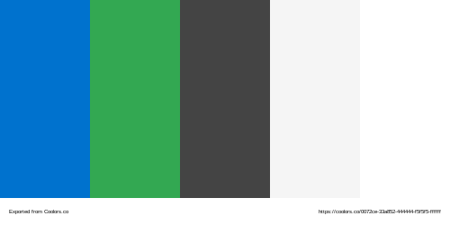

# Mairie Plus - Graphic Charter

## 🎨 Brand Identity

Mairie Plus is a modern and efficient digital solution for municipal productivity. Our visual identity reflects **clarity, trust, and innovation**.

## 📌 Logo
### **Primary Logo**
- The main logo features a stylized **mairie (town hall)** icon combined with a **'+' symbol**, symbolizing improvement and modernization.
- **Color:** Blue and Teal to reflect trust, reliability, and digital innovation.
- **Typography:** Modern sans-serif typeface for readability and professionalism.

### **Logo Variations**
- **Primary Version:** Full-color logo on a white or light background.
- **Monochrome Version:** Black or white version for specific use cases.
- **Icon-Only Version:** For small spaces like favicons and app icons.

## 🎨 Colors
Our color palette is designed to convey trust, accessibility, and modernity.

| Color Name        | Hex Code  | Usage                                                                   |
| ----------------- | --------- | ----------------------------------------------------------------------- |
| **Institution Blue** | `#0056A6` | Couleur principale, utilisée pour les éléments clés (logo, boutons, titres) |
| **Civic Teal**      | `#248F8D` | Couleur secondaire, pour les accents et éléments de mise en valeur       |
| **Reliable Grey**   | `#3C3C3C` | Couleur de texte pour un bon contraste et une lecture confortable        |
| **Pure White**      | `#FFFFFF` | Espaces de respiration et éléments contrastés                            |
| **Soft Beige**      | `#EFEDE7` | Fond neutre et apaisant, idéal pour les interfaces et documents          |

## 🔤 Typography
We use modern and readable fonts for a clean and professional look.

- **Primary Font:** *Poppins* (Sans-serif) – for headings, UI elements, and branding.
- **Secondary Font:** *Roboto* – for body text and longer content.

## 🖌️ Iconography & Illustrations
- Icons should be **flat, simple, and minimalistic**, aligning with modern UI standards.
- Illustrations should use a **flat design style**, with clean lines and soft color gradients.

## 📣 Usage Guidelines
- Always maintain **proper spacing** around the logo.
- Do not alter the logo colors or proportions.
- Ensure text contrast meets **accessibility standards (WCAG 2.1)**.
- Use brand colors consistently across all digital and print materials.

## 📁 Assets & Resources
- **Logo Files:** Available in PNG, SVG, and JPG formats.
- **Typography Files:** Hosted on Google Fonts.
- **UI Kit:** Figma / Sketch file with buttons, icons, and elements.

📩 Need the assets? Contact us at **[Your Email]** for access.

---

This graphic charter ensures that Mairie Plus maintains a **consistent and professional** brand image across all platforms. 🚀
